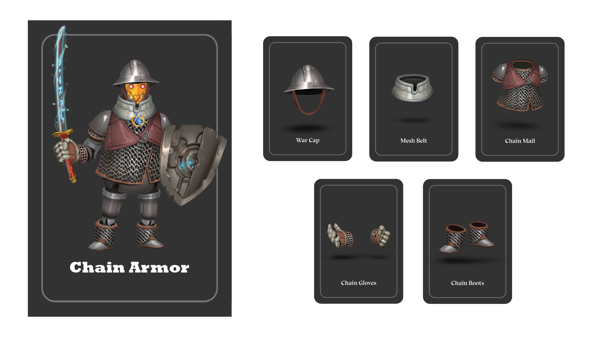

# ⛓ Chian Armor : ฝุ่นเหล็ก IRONDUST

### <mark style="color:yellow;">ข้อมูลชุดเกราะ</mark> ฝุ่นเหล็ก IRONDUST

ชุดเกราะแห่งความพยายาม แม้มีตำแหน่งต่ำต้อยในสนามรบ เป็นตัวแทนของ 'คนตัวเล็ก' แต่เป็นผู้เสียสละที่ยิ่งใหญ่ ยอมแลกทุกสิ่งทุกอย่างที่มี (แม้กระทั่งชีวิตของตัวเอง) เพื่อชัยชนะ การโจมตีจึงหนักหน่วง, รุนแรง และต่อเนื่อง รวมถึงการป้องกันที่แข็งแกร่ง ดุดัน พร้อมความสามารถพิเศษที่พิเศษสุดไม่เหมือนใคร!

.png>) 

### <mark style="color:yellow;">Passive Skill</mark>

* ทุกครั้งที่ตาย IRONDUST จะสามารถ <mark style="color:yellow;">Trade</mark> การ์ดบนมือตัวเองกับการ์ดที่อยู่ใน <mark style="color:orange;">กองทิ้งการ์ด</mark> ได้ 1 ใบ (Armor Card Dispile)

### <mark style="color:yellow;">Action Skill</mark>

* เมื่อทำการโจมตีผู้เล่นอื่น จะทำให้ผู้เล่นนั้น <mark style="background-color:red;">-1HP</mark> และ <mark style="color:yellow;">ติดสตั้น(Stun)</mark> หยุดเดิน 1 ตา
* สามารถจ่ายเลือดตัวเอง <mark style="background-color:red;">-1HP</mark> เพื่อเพิ่ม <mark style="color:red;">ATK</mark> จาก <mark style="color:red;">1ATK</mark> เป็น <mark style="color:red;">2ATK</mark>

### <mark style="color:yellow;">Special Skill</mark>

หาก IRONDUST หยิบได้ [<mark style="color:purple;">'ดาบ</mark> <mark style="color:purple;"></mark><mark style="color:purple;"><mark style="color:purple;">Katana'<mark style="color:purple;"></mark>](../event-card.md#weapon) จะเลือกใช้ 1 ใน 2 ท่านี้ (เมื่อเข้า Action เฟส) ได้หนึ่งครั้ง คือ

1. <mark style="color:yellow;">Suicide Bomb</mark> : ระเบิดตัวตาย <mark style="background-color:red;">-2HP</mark> ทุกคน\*\*
2. <mark style="color:yellow;">Kamikaze</mark> : เลือก 1 เป้าหมาย และตายไปพร้อมกัน\*\*

<mark style="background-color:orange;">**\*\* เมื่อ IRONDUST ตาย จะทำให้ดาบ Katana หลุดมือ และตกลงสู่กองทิ้งการ์ด ทำให้ความสามารถพิเศษหมดไปกลับสู่ปกติ**</mark>

<mark style="background-color:yellow;">\*\*(ทั้งสองท่าจะทำให้ IRONDUST : Chain Armor ใช้ Passive Skill ของตัวเองได้ง่ายและไวขึ้น)\*\*</mark>
