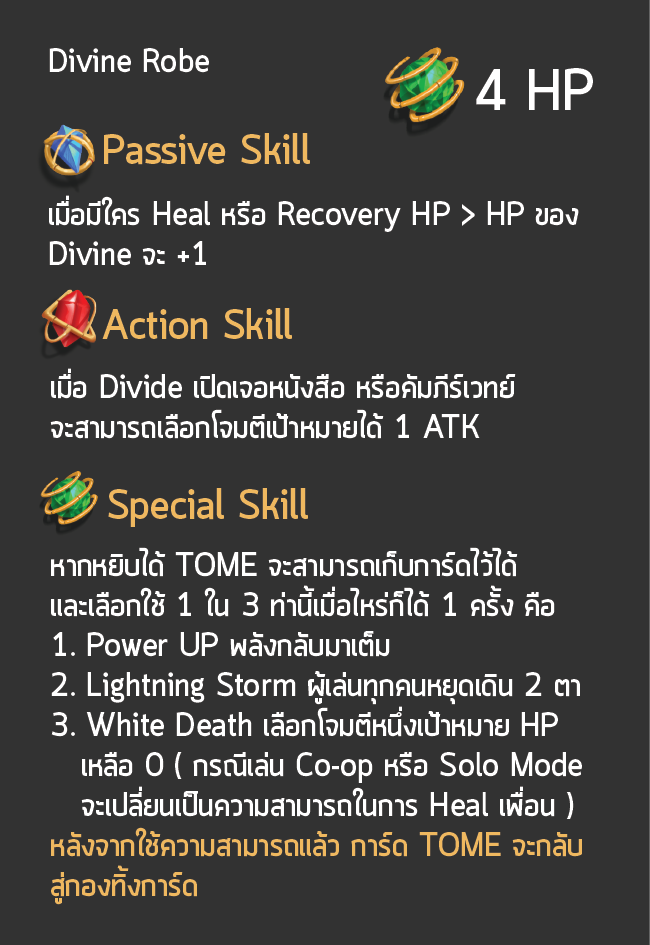

# 👼 Divine Rob

### <mark style="color:yellow;">ข้อมูลชุดเกราะ</mark>

ในสนามรบที่ดุเดือดผู้ที่คอยกำหนดทิศทางของการต่อสู้ ผู้ที่คอยช่วยเหลือ ผู้ที่ทำให้หลายคนสับสนและผู้ที่ได้รับชื่อว่าพ่อมดผู้แข็งแกร่ง พ่อมดขาวผู้ใช้พลังศักดิ์สิทธิ์

 

### <mark style="color:yellow;">Passive Skill</mark>

* เมื่อมีใคร <mark style="color:yellow;">Heal</mark> หรือ <mark style="color:yellow;">Recovery HP</mark> -> จะส่งผลให้ Divine Robe <mark style="background-color:red;">+1HP</mark> ทันที

### <mark style="color:yellow;">Action Skill</mark>

* เมื่อ Divine Robe เปิดเจอ[<mark style="color:purple;">หนังสือ หรือคัมภีร์</mark>](../event-card.md#undefined)จะสามารถเลือก<mark style="color:red;">โจมตีเป้าหมาย</mark>ได้ 1 ATK

### <mark style="color:yellow;">Special Skill</mark>

หากหยิบได้ <mark style="color:purple;">TOME</mark> จะสามารถเก็บการ์ดไว้ได้และเลือกใช้ 1 ใน 3 ท่านี้เมื่อไหร่ก็ได้ 1 ครั้งต่อ 1 ใบที่เจอ คือ

* <mark style="color:yellow;">Power UP</mark> : พลังกลับมาเต็ม
* <mark style="color:yellow;">Lighting Storm</mark> : ผู้เล่นทุกคนหยุดเดิน 2 ตา
* <mark style="color:yellow;">White Death</mark> : เลือกโจมตีหนึ่งเป้าหมาย <mark style="background-color:red;">HP เหลือ 0</mark> (กรณี Co-op หรือ Solo Mode จะเปลี่ยนเป็นความสามารถในการ Heal เพื่อน)

<mark style="background-color:yellow;">\*\*หลังจากใช้ความสามารถแล้วการ์ด TOME จะกลับสู่กองทิ้งการ์ด</mark>
