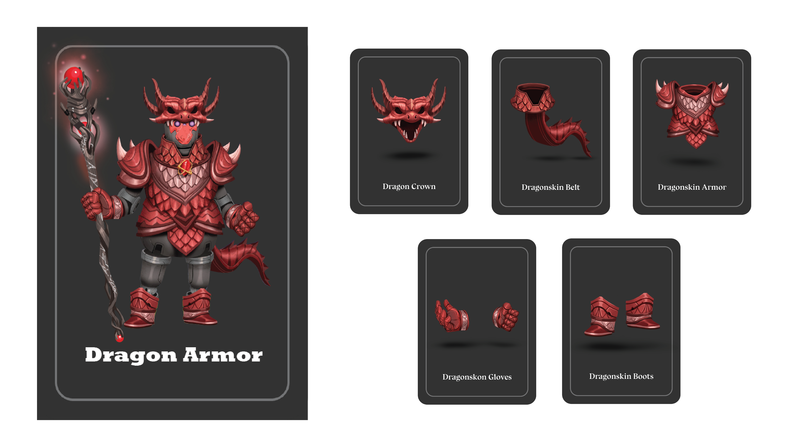

# 🐉 Dragon Armor

### <mark style="color:yellow;">ข้อมูลชุดเกราะ</mark>

เมื่อสงครามเกิดขึ้นผลกระทบก็แผ่ขยายไปทั่วทั้งอาณาจักร การสูญเสียก็เกิดขึ้น หลายคนต้องสูญเสียผู้เป็นที่รักเหล่าไม่เว้นแม้แต่ลูกหลานแห่งมังกร พวกเขาจึงลุกขึ้นสู้เพื่อปกป้องเผ่าพันธุ์และที่อยู่อาศัย จากหยิบยืมซึ่งพลังแห่งบรรพบุรุษแห่งมังกร เหล่านักรบมังกรจึงเข้าสู่สงคราม

.png>) 

### <mark style="color:yellow;">Passive Skill</mark>

* เมื่อมี<mark style="color:red;">การโจมตี</mark>หรือ<mark style="color:red;">สร้างดาเมจ(Damage)</mark>จาก[<mark style="color:orange;">มังกร(Dragon)</mark>](../event-card.md#dragon) จะ`ไม่ส่งผล`กับผู้ที่สวมชุด <mark style="color:blue;">Dragon Armor</mark>

### <mark style="color:yellow;">Action Skill</mark>

เมื่อเปิดเจอการ์ด Dragon จะได้รับพลังพิเศษ

* <mark style="color:yellow;">Reset HP</mark> ได้ทันที
* สามารถสั่งมังกร<mark style="color:red;">โจมตี</mark>ผู้เล่นคนอื่นได้ <mark style="background-color:red;">ATK+3</mark> (เมื่อรวมกับ <mark style="color:orange;">Effect</mark> ของการ์ดมังกร จะเป็น <mark style="background-color:red;">4ATK</mark>)

### <mark style="color:yellow;">Special Skill</mark>

* หากหยิบได้ <mark style="color:purple;">Ghost Wand</mark> จะสามารถหยิบการ์ด [<mark style="color:orange;">Dragon</mark> ](../event-card.md#dragon)ทั้งหมดที่อยู่ในกองทิ้งการ์ดมาวางเตรียมไว้<mark style="color:red;">โจมตี</mark>คนอื่นในเวลาที่ต้องการได้
* <mark style="background-color:red;">HP +1Slot</mark> ต่อ <mark style="color:purple;">Ghost Wand</mark> 1 อัน(ถาวร)

<mark style="background-color:yellow;">\*\*หากตาย ไม้เท้า</mark> <mark style="color:purple;background-color:yellow;">Ghost Wand</mark> <mark style="background-color:yellow;">ทั้งหมดจะกลับสู่กองทิ้งการ์ด โดยหลอด HP จะยังคงอยู่ต่อไปจนกว่าจะจบเกม</mark>
