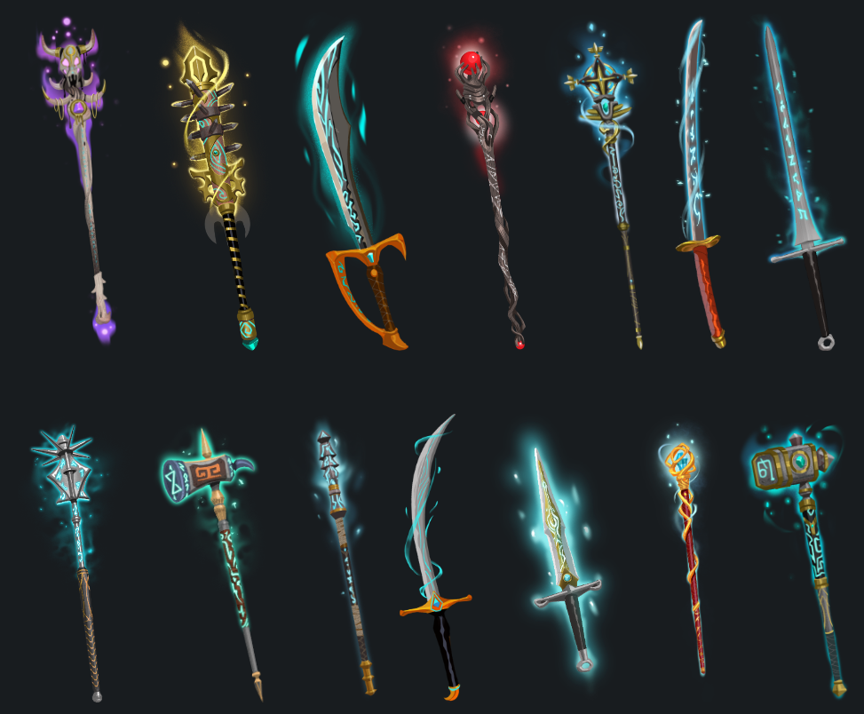
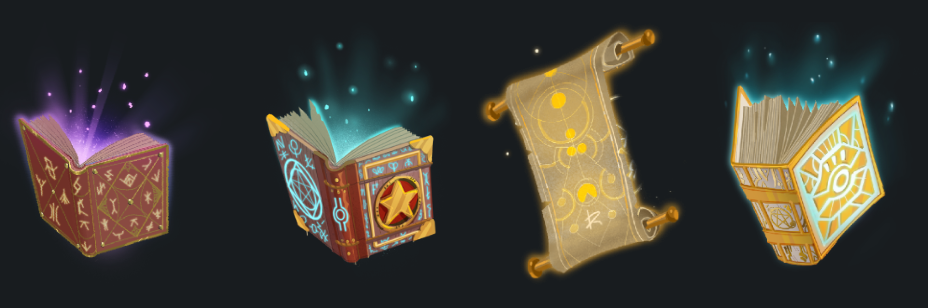
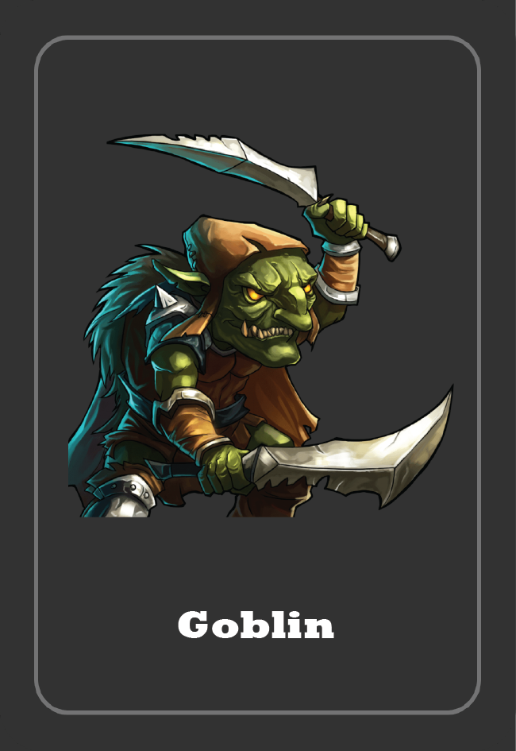

# 🏹 Event Card

### <mark style="color:yellow;">Event Card จะมีหลายรูปแบบ</mark>

* Weapon (อาวุธ)
* หนังสือ หรือคัมภีร์
* Goblin (ก็อบบลิน)
* Dragon (มังกร)
* กับดัก หรือดาเมจ (Damage)

### <mark style="color:yellow;">Weapon (อาวุธ)</mark>

เมื่อเจอ <mark style="color:yellow;">Weapon Card</mark> จะเลือกได้ว่า

* <mark style="color:red;">โจมตี</mark> ผู้เล่นอื่น <mark style="background-color:red;">HP-1</mark>
* กำจัด [<mark style="color:green;">Goblin</mark> ](event-card.md#goblin)ที่เกาะตัวเราอยู่
* <mark style="color:yellow;">Full Recovery</mark> (HP Max สูงสุดตามสถานะของผู้เล่น)

### <mark style="color:yellow;">หนังสือ หรือคัมภีร์</mark>

* เมื่อเจอ <mark style="color:yellow;">Book Card</mark> จะเป็นการเคลียร์, shuffle หรือล้าง [<mark style="color:orange;">Assets Card</mark>](armor/) ที่ <mark style="color:yellow;">'เปิดโชว์อยู่ทั้งหมด'</mark> และทำการเปิดการ์ดใหม่จำนวน 6 ใบมาวางแทนการ์ดเดิม

### <mark style="color:yellow;">Goblin (ก็อบบลิน)</mark> 

* เมื่อเจอ <mark style="color:green;">Goblin Card</mark> ผู้เล่นที่เปิดเจอ <mark style="background-color:red;">HP-1</mark> ทันที (มีข้อแม้สำหรับ [<mark style="color:purple;">Ornate Armor</mark>](armor/ornate-armor.md))
* หากไม่สามารถกำจัด <mark style="color:green;">Goblin</mark> ในทันที <mark style="color:green;">Goblin</mark> จะกัดลึกขึ้น และ <mark style="color:red;">DMG</mark> จะทบในรอบถัดไป <mark style="background-color:red;">HP-1</mark> ทุกเทิร์นหลังจากเข้า Action เฟส (เป็นการบาดเจ็บที่สะสมได้/สถานะคล้ายติดพิษ)

### <mark style="color:yellow;">Dragon (มังกร)</mark>

* เมื่อเจอ <mark style="color:yellow;">Dragon Card</mark> ผู้เล่นที่เปิดเจอ <mark style="background-color:red;">HP-2</mark> และ ผู้เล่นคนอื่น <mark style="background-color:red;">HP -1</mark> (มีข้อแม้สำหรับ [<mark style="color:purple;">Ornate Armo</mark>](armor/ornate-armor.md)<mark style="color:purple;">r</mark> และ <mark style="color:purple;">Dragon Armor</mark>)

### <mark style="color:yellow;">กับดัก หรือดาเมจ (Damage)</mark>

* เมื่อเจอกับดัก หรือ <mark style="color:yellow;">Damage Card</mark> ผู้เล่น <mark style="background-color:red;">HP-1</mark>

### <mark style="color:yellow;">Energy Card</mark>

* เมื่อเจอ <mark style="color:yellow;">Energy Card</mark> จะสามารถ <mark style="color:blue;background-color:green;">Heal HP+1</mark> <mark style="color:blue;"></mark> (โหมดง่ายหรือ beginer mode จะเก็บสะสมและนำมาใช้ในเวลาที่ต้องการได้แม้ HP จะเต็มหลอดอยู่ // แต่โหมดยาก หรือ Insane Mode ต้องใช้หรือทิ้งทันที ไม่สามารถเก็บ)

